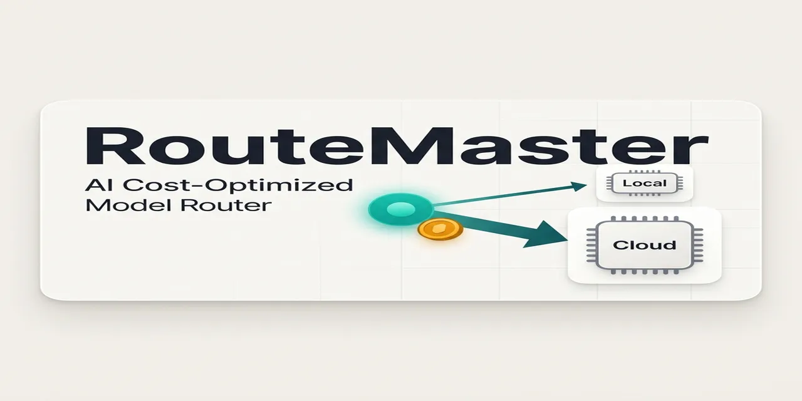
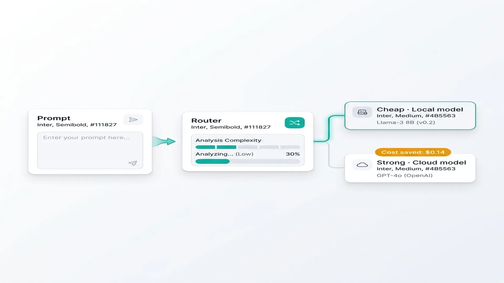
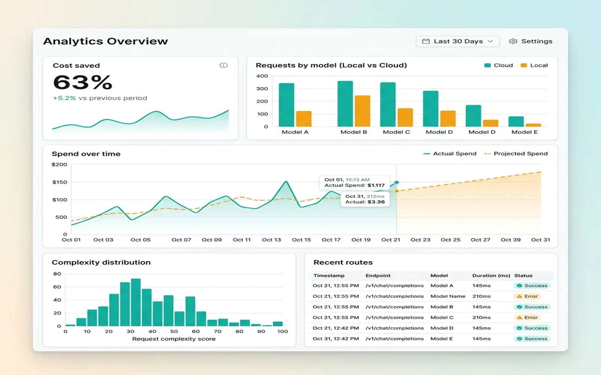
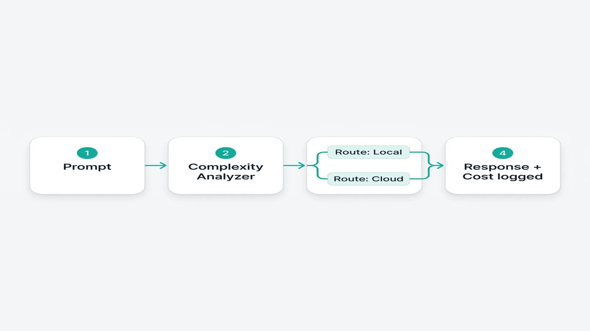
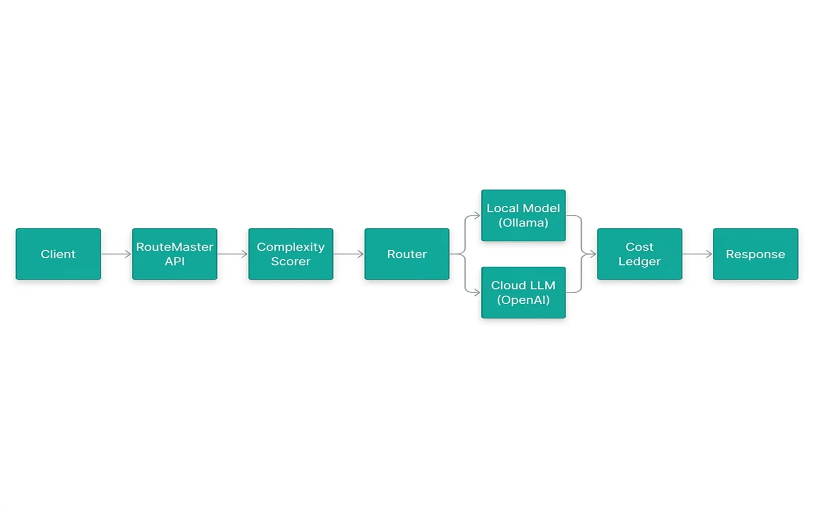
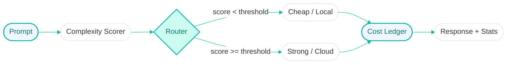

# RouteMaster
### Cost-optimized AI model router — sends each prompt to the cheapest model that can actually handle it.




## 📖 Overview



Most LLM apps send every request to one expensive model. RouteMaster scores each prompt's reasoning
difficulty from cheap, explainable signals, then routes simple prompts to a **cheap/local** model and
hard ones to a **strong/cloud** model — measuring the cost saved against an all-strong baseline.

It's provider-agnostic: without an API key it runs a deterministic local/mock provider (so it — and its
tests — work fully offline); with `OPENAI_API_KEY` set it routes to real models.

> Part of my Senior Hybrid Engineer 2026 portfolio (`#16`). Antigravity model — logic runs locally, heavy
> reasoning is offloaded to the cloud only when the prompt actually needs it.

## 🚀 Quick Start
```bash
git clone https://github.com/Kimosabey/route-master.git
cd route-master

npm test          # 9 tests, zero dependencies (Node 22 runs the TS directly)
npm run demo      # route a sample batch, print the cost-savings summary
docker compose up # serve the HTTP API on :3000
```

### API
```bash
# route a prompt
curl -s localhost:3000/route -H 'content-type: application/json' \
  -d '{"prompt":"Design and analyze a fault-tolerant rate limiter; prove correctness step by step."}'
# -> {"decision":{"tier":"strong","complexity":0.52,...},"cost":0.00078,"model":"cloud-gpt",...}

curl -s localhost:3000/stats   # spend vs. all-strong baseline + per-tier counts
```

### Demo output
```
tier    complexity   cost      prompt
cheap        0.01   $0.00000  Translate "hello" to French.
strong       0.52   $0.00066  Explain step by step why quicksort is O(n log n)...
strong       0.72   $0.00069  Refactor this and debug the race condition: ```js...

Summary:  7 requests (cheap 4 / strong 3)  ·  cost saved 21% vs. all-strong
```

## ✨ Key Features



- **Explainable complexity scoring** — length, reasoning keywords, code detection, question depth → a 0–1 score (every decision carries its `reason`).



- **Tiered routing** with a configurable threshold (`THRESHOLD`, default 0.5).
- **Provider-agnostic** — one `ModelProvider` interface; `MockProvider` (offline) and `OpenAIProvider` (real) ship in the box.
- **Cross-tier fallback** — if the chosen provider errors, the request fails over to the other tier instead of dropping.
- **Measured savings** — a cost ledger reports spend vs. the all-strong baseline; savings are computed, not asserted.

## 🏗️ Architecture




The hard part is making the routing decision *cheap and honest*: the score has to be trivial to compute
(no extra model call) yet accurate enough that quality holds while cost drops. See
[docs/ARCHITECTURE.md](./docs/ARCHITECTURE.md).

## 🧰 Tech Stack
| Layer | Technology | Role |
| :--- | :--- | :--- |
| Runtime | Node.js 22 (TypeScript, no build step) | Type-stripped execution + built-in test runner |
| Transport | Node `http` | Zero-dependency HTTP API |
| Providers | OpenAI-compatible / mock | Pluggable model backends |
| Container | Docker + Compose | One-command run |

## 📚 Documentation
- [Architecture](./docs/ARCHITECTURE.md) — scoring model, routing, fallback, cost accounting
- [Getting Started](./docs/GETTING_STARTED.md) · [Failure Scenarios](./docs/FAILURE_SCENARIOS.md) · [Interview Q&A](./docs/INTERVIEW_QA.md)

## 🔭 Future Enhancements
- Learned routing thresholds from outcome feedback
- Latency-aware routing (not just cost)
- Semantic response caching in front of the router
- Per-tenant budget caps

## 📄 License
Released under the MIT License.

## 👤 Author

**Harshan Aiyappa**
Senior Full-Stack Hybrid AI Engineer
Voice AI • Distributed Systems • Infrastructure

[](https://kimo-nexus.vercel.app/)
[](https://github.com/Kimosabey)
[](https://linkedin.com/in/harshan-aiyappa)
[](https://x.com/HarshanAiyappa)
