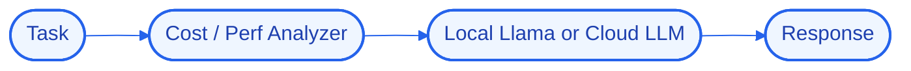

# Architecture — RouteMaster

## High-Level Design (HLD)
RouteMaster analyzes each incoming task and routes it to a capable-but-cheap model — a local Llama model for simple work, a frontier cloud model only when the task genuinely needs it.

**Flow:** Task → Cost / Perf Analyzer → Local Llama or Cloud LLM → Response

## Low-Level Design (LLD)
- **Components:** `Node.js`, `OpenAI`, `Ollama`
- **Interfaces / contracts:** to be finalized during implementation.
- **Data model:** to be defined per component.

## Decision Log
- **Why this stack:** **Node.js** — application runtime / service layer; **OpenAI** — cloud llm reasoning; **Ollama** — local llm runtime.
- **Antigravity constraint:** run logic/state/UI locally; offload heavy reasoning to cloud APIs; target modest hardware.

## Concept Deep Dive
Classifying task difficulty cheaply and reliably enough that the routing decision itself does not cost more than it saves.
